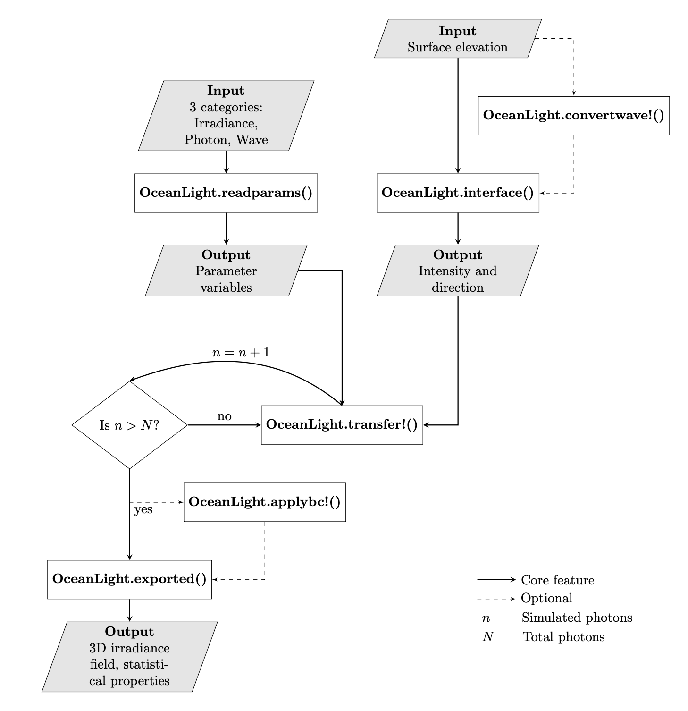

# Summary

`OceanLight` is a Julia-based scientific package that simulates photon trajectories and records their downward irradiance field in three-dimensional (3D) space using direct Monte Carlo (MC) simulation. Photons, initially located in the air phase, are emitted vertically toward the water surface. They experience refraction at the water surface, as well as absorption and scattering within the water column. `OceanLight` tracks the spatial locations and energies of all photons, enabling the calculation of downwelling irradiance. The full 3D irradiance field and statistics are exported and can be accessed in HDF5 format.

# Statement of need

Optical oceanography concerns all aspects of light and its interaction with seawater, which are crucial for addressing problems related to physical, biological, and chemical oceanographic processes, such as phytoplankton photosynthesis, biogeochemical cycles, and climate change [@Dickey:2011;@Dickey:2006]. However, due to the complex interaction between light and free-surface wave geometry, the irradiance distribution can be highly variable [@Darecki:2011;@Gernez:2011], making it difficult to obtain analytical solutions.

One prominent numerical method is the implementation of the MC approach to approximate the light field. The general idea is to construct probability distributions of photon trajectories by repeatedly sampling random paths, including scattering, absorption, and path lengths. Despite its generality, this method has proven to be powerful [@Mobley:1994]. The MC method has been widely applied to various specific problems related to the calculation of downward irradiance field. For instance, an MC radiative transfer solver has been developed that accounts for the shadowing effect and detector size [@Xu:2014], and direct MC simulations have been performed for both polarized and unpolarized light [@Xu:2011].   

Here, we introduce `OceanLight`, a Julia-based software package designed to facilitate three-dimensional direct MC simulation of light fields in seawater. `OceanLight` is based on the forward MC algorithm as described by @Mobley:1994. It includes light refraction at the air-water interface, where the refraction angle in the water phase is computed using Snell's Law, and the proportion of transmitted light is determined by the Fresnel equations. The probability distribution of the polar angles in scattering events is based on the measurements reported by @Petzold:1972 [@Kirk:1981]. Additionally, `OceanLight` supports parallel computing to enhance performance and reduce computational time. The downwelling irradiance fields generated by `OceanLight` also serves as a valueable resource for machine learning applications, enabling the development of accelerated models that require lower computational costs [@Hao:2022]. 

# Main Features

The main features of `OceanLight` are illustrated in figure 2.

`OceanLight` requires user input in three categories.

1. **Irradiance:** resolution of the solution grid, attenuation coefficients, and boundary condition specification 
2. **Photon:** number of photons and grid spacing
3. **Wave:** ocean surface elevation and related attributes 

`OceanLight` reads input parameters from `.yml` files and stores it in Julia's `struct` format. In addition, surface wave attributes, comprising surface elevation and its partial derivatives in the x and y directions, are required.  Users can either generate randomized surface elevations using `OceanLight.setwave!` or import their own data and convert it to a format that aligns with the photon entry grid using `OceanLight.convertwave!`.

At the air–water interface, `OceanLight.interface` calculates the polar angle $\theta$ and azimuthal angle $\phi$ at which photons are transmitted into the water, using Snell’s Law. The portions of transmitted and reflected light energy are determined using the Fresnel equations.

Once photons are transmitted into the water, `OceanLight.transfer` simulates their paths using the direct MC method. Each photon is tracked as it travels through the water column, with its position updated after every scattering or absorption event. The process continues until the photon either vanishes in absorption or reaches the bottom boundary. To accelerate computation, `OceanLight`supports parallel processing via MPI, distributing photons evenly across CPU threads. Upon completion, the results are gathered and combined to reconstruct the irradiance field.

Simulation output can be exported in HDF5 (`.h5`) format using `OceanLight.exported`, allowing users access to the full three-dimensional irradiance field and its statistical properties.

To demonstrate the capabilities of this package, we simulate downwelling irradiance in two scenarios:

* *Flat water surface:* $\left(\eta = 0  \right)$ Up to $10^{8}$ photons are emitted at a single point at the center of a domain of $x,y \in [\mathrm{−10m},\mathrm{10m}]$, which results in a focused light intensity field. 

* *Realistic surface geometry:* At every grid point on the free surface of an irregular wave field, $10^{3}$ photons are emitted in a domain of $x,y \in [\mathrm{−40m},\mathrm{40m}]$. 

In both cases, the optical properties of water are identical, with an absorption coefficient $a = 0.0196\ \mathrm{m^{-1}}$ and a scattering coefficient $b = 0.0031\ \mathrm{m^{-1}}$, representing seawater attenuation at a wavelength of $490 \mathrm{nm}$ [Smith:1981]. The irradiance field is stored on a grid of $512 \times 512 \times 190$ points, spanning a vertical domain of $z \in [\mathrm{−190m},\mathrm{10m}]$. Periodic boundary conditions are applied on horizontal directions. 

In the flat surface case, all photons are transmitted perpendicular to the surface, as determined by the Fresnel equations. Since all photons are emitted from a single point, the downwelling irradiance at the center is significantly higher compared to the surrounding area. As the water depth increases, the light becomes slightly dimmer due to the effect of absorption.

In the second scenario, we simulate a more realistic case using imported irregular surface elevation data and a uniformly distributed light input. The spatial spacing of the incoming photons matches the `dx` and `dy` values used in the simulation grid. 

In the case of evenly distributed photons, similar phenomena to those observed with a flat surface are expected. The effects of absorption and scattering become more pronounced. At a depth of $30\ \mathrm{m}$, the downwelling irradiance distribution reflects the surface elevation field: photons are transmitted nearly perpendicular to the surface around the crests of free-surface waves, producing bright focal spots, while around the troughs, photons diverge, resulting in dimmer areas. As depth increases, absorption reduces the overall irradiance, while the scattering effect of seawater causes the focal spots to diverge and broaden.

# Acknowledgement 

Xuanting Hao contributed to the code implementation and numerical modeling. Pacharadech Wacharanan contributed to the organization and documentation of the numerical solver. The authors would like to thank Sai Pramod Anumula and Yifeng Mao for their valuable feedback and comments on this project. 

# References

